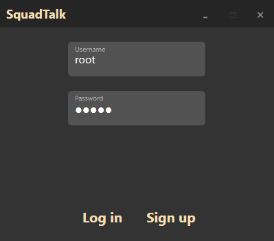
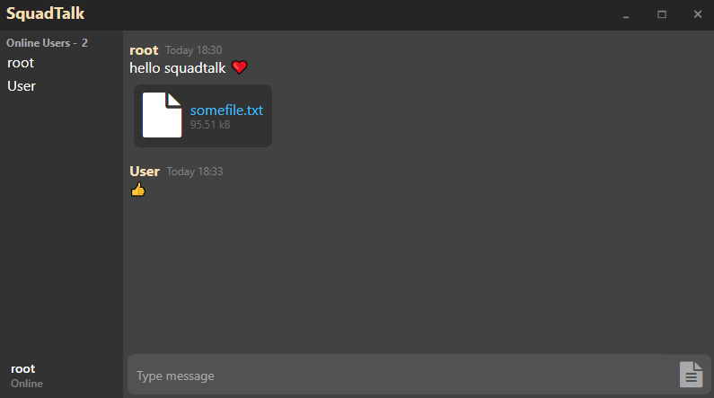

# Chat App

WPF chat application to send and receive messages using ASP.NET Core server.

## Screenshots

Login window

Main window

## Features 

* Real-time messaging achieved with `SignalR`.
* User authorization using `JWTBearer`.
* Support for sending large files using [Tus Server](https://github.com/tusdotnet/tusdotnet) and
  [Tus Client](https://github.com/jonstodle/TusDotNetClient).
* Hashing credentials using [Argon2id](https://github.com/kmaragon/Konscious.Security.Cryptography) algorithm.
* SQL database for storing user info.

